&nbsp;  
&nbsp;


&nbsp;  
&nbsp;

탈중앙화 메시징 플랫폼을 지향하는 Status는 중앙화된 서버 없이도 안전하게 메시지를 전송하기 위한 방법으로 P2P(Peer to peer) 기술을 이용한다.

P2P 아키텍처 상에서 메시지는 네트워크의 일부이자 서비스 제공자인 '노드(node)'를 통해 전달되며, 운영중인 노드가 많아질수록 Status Network는 더욱 안정화된다.

Status는 사용자가 주체가 되는 탈중앙화 플랫폼이기 때문에 누구든지 약간의 노력으로 자신의 컴퓨터나 클라우드를 이용해 Status의 노드를 운영해볼 수 있다. 아직 노드 운영에 대한 정기적인 보상(Node Incentive)은 없지만 이는 향후 구체화 될 전망이며 이를 통해 Status Network의 가치는 크게 증가될 것이다.

한편, Azure는 Microsoft에서 제공하는 Public Cloud Service이다.

최초 가입시 한달간 200달러 상당의 크레딧이 제공되며 12개월간 일부 인기서비스를 무료로 이용할 수 있기 때문에, 단기간동안 가벼운 테스트용도에서 상대적으로 AWS보다 비용이 저렴하다.

이번 글에서는 Azure가 최초 가입 사용자에게 주는 혜택을 활용하여, 저렴한 비용으로 스테이터스 노드를 운영해볼 수 있는 방법을 소개한다.

### Azure 이용시 알아야 할 사항

**특징**

- 첫달 약 200,000원 상당 무료 크레딧 제공\*
- Data transfer 5 GB까지 무료
- 2개의 64GB SSD 디스크 무료 제공\*
- 1코어 1GB RAM 성능의 가상머신 무제한 생성 가능\*

_\*Free Trial Benefit(Azure 최초 이용자에게 12개월간 제공하는 혜택)_

**Node 운영 시 과금 요소(Free Trial 기간 내)**

- Public IP address 이용료 - 30일 기준 약 3,200원($0.004/hour)
- 5GB 초과분의 데이터 전송 비용 ([Pricing Detail](https://azure.microsoft.com/en-us/pricing/details/bandwidth/)) - 운영해본 결과 한달 1만원 이내

_\*Note: 첫달은 제공 되는 무료 크레딧으로 차감 가능_

**Free Trial 기간(12개월) 이후 추가 과금 요소**

- 가상머신 Compute(CPU + Memory) 이용료
- 가상머신 디스크 이용료

### Step-by-step 노드 설치 가이드

```
[노드 생성 절차 간단 요약]

1. Azure 가입 및 무료평가판 구독 생성
2. 리눅스 가상머신 생성
3. 포트 정책 추가
4. 가상머신 원격 접속(SSH)
5. 컨테이너 생성
6. 노드 설치 및 구동
7. 작동 테스트
```

**Azure 가입 및 무료평가판 구독 생성**

아래 링크를 통해서 계정 및 무료 평가판 구독을 생성한다.

Azure Free Trial

[https://azure.microsoft.com/ko-kr/free/](https://azure.microsoft.com/ko-kr/free/)

생성이 완료된 후 [Azure portal > Subscriptions > Overview] 페이지로 이동해보면 아래와 같은 화면을 볼 수 있다.

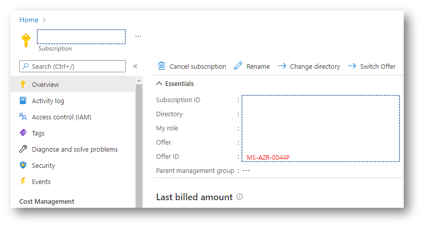

여기서 Offer ID가 'MS-AZR-0044P'이면 Free trial 구독이다.

Offer ID가 다를 경우 12개월 무료 혜택이 아닌 것이기 때문에 위에 언급된 가상머신 Compute와 Disk 비용이 추가로 발생하게 되니 주의가 필요하다.

**리눅스 가상머신 생성**

- [Azure Portal](https://portal.azure.com/) 로그인
- 검색창에 'Free Service' 입력 + Linux Virtual Machine 'Create' 클릭

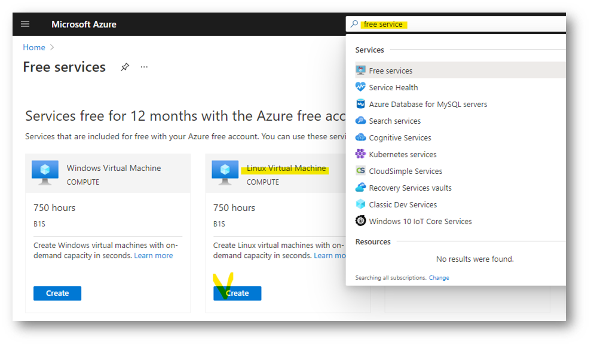

- [VM Creation Form] 화면 정보

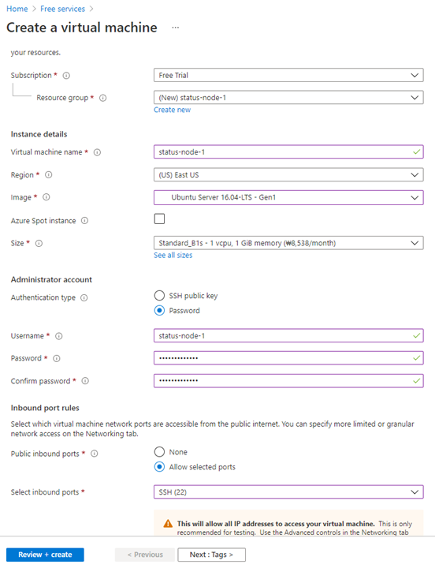

- [VM Creation Form] Size가 'Standard_B1'인지 확인

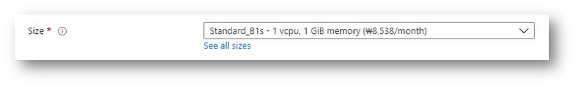

- [VM Creation Form] 인증방식(Authentification Type) 'Password' 선택

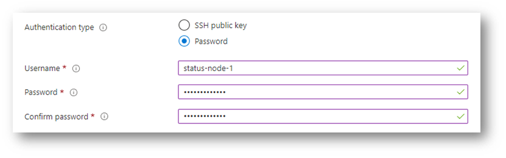

_\*Note: Password 방식의 경우 어디서든 IP를 통해 접속시도를 할 수 있어 계정 정보 취급에 주의 필요_

- [VM Creation Form] SSH(22) 포트를 허용하도록 체크

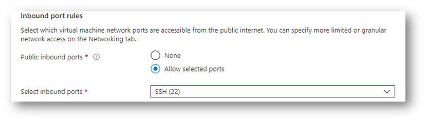

- [VM Creation Form] 'Review + Create'를 클릭하여 가상머신 생성

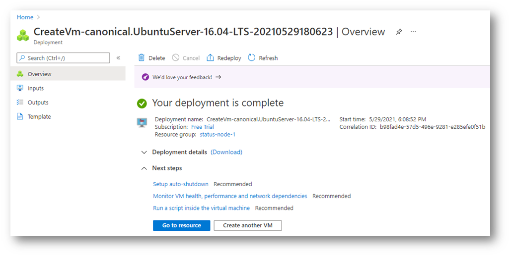

생성 후 화면. Go to resource를 클릭하여 가상머신 메뉴로 진입한다.

**포트 정책 추가**

- Azure portal > Virtual Machine > [Your VM name] >Networking 메뉴로 진입

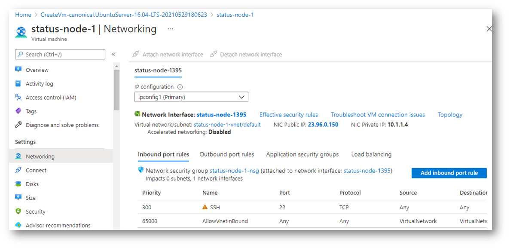

- Inbound port 규칙을 추가하여 30303포트 열기(TCP, UDP 두가지)

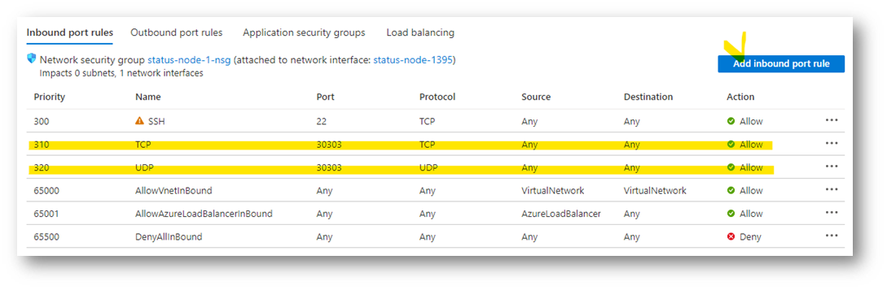

**가상머신 원격 접속(SSH)**

- Windows의 'Powershell', MacOS의 'Terminal'등 커맨드라인 툴을 실행. 아래 명령어를 이용하여 리눅스 가상머신에 접속

```bash
ssh [Virtual Machin Name]@[IP Address]
```

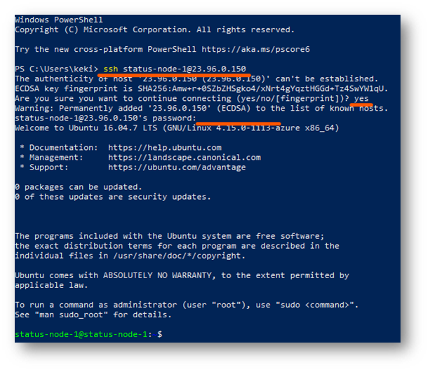

_\*Note: IP 주소는 Azure portal > Virtual Machine > [Your VM name] > Overview' 페이지에서 확인 가능_

**Tool 설치**

_\*Note: Code 박스의 Script를 한줄씩 복사하여 실행_

- Docker 설치 및 등록

```bash
sudo apt-get update
sudo apt install docker.io
sudo systemctl start docker
sudo systemctl enable docker
docker --version
sudo usermod -aG docker $USER
newgrp docker
```

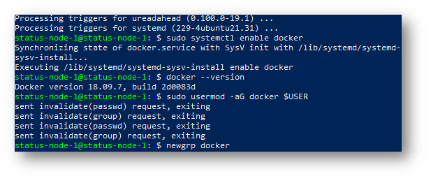

- docker-compose 설치

```bash
sudo curl -L "https://github.com/docker/compose/releases/download/1.26.2/docker-compose-$(uname -s)-$(uname -m)" -o /usr/local/bin/docker-compose
sudo chmod +x /usr/local/bin/docker-compose
docker-compose --version
```

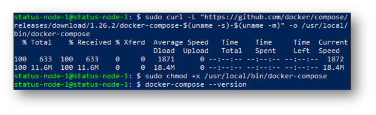

- make 설치

```bash
sudo apt install make
```

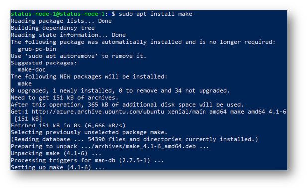

- jq 설치

```bash
sudo apt-get install jq
```

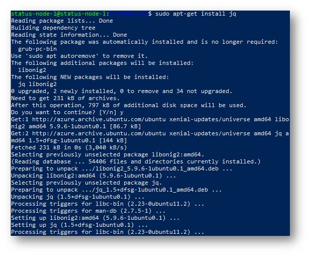

**Status 내려받기 및 노드 실행**

- status-go 클론

```bash
git clone https://github.com/status-im/status-go.git
cd status-go/
```

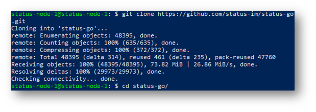

- Status 노드 실행

```bash
make run-mailserver-docker
```

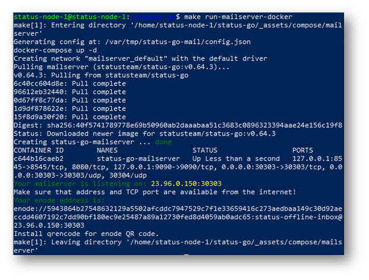

**작동 테스트**

- 연결된 피어(peer)의 IP 주소 확인

```bash
export DATA='{"jsonrpc":"2.0","method":"admin_peers","params":[],"id":1}'
curl -s -H 'content-type: application/json' -d "$DATA" localhost:8545 | jq -r '.result[].network.remoteAddress'
```

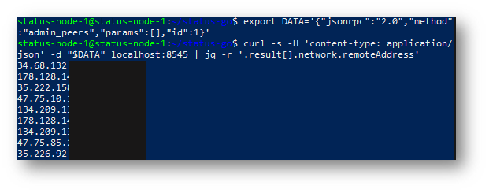

- 일간 누적 메시지 갯수 확인

```bash
curl -s localhost:9090/metrics | grep '^waku_envelopes_received_total'
```

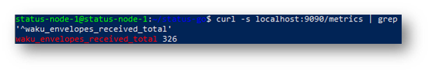

### Azure Portal 비용 확인 방법

Azure portal > Subscriptions > [Your Subscription Name] > Cost analysis 페이지에서 아래와 같이 비용 확인이 가능하다.

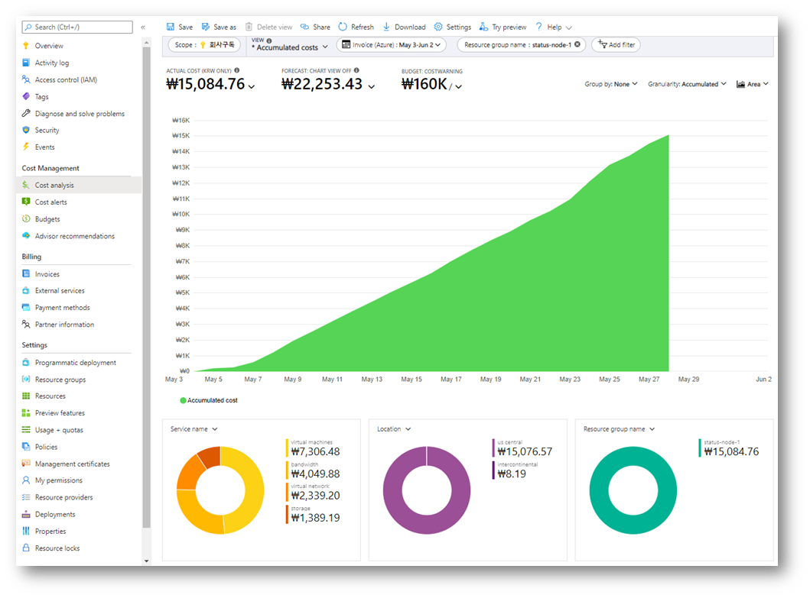

### 마치며,

지금까지 Azure 12개월 무료 혜택을 이용하여 Status 노드를 운영하는 방법에 대해 알아보았다.

경험에 의존한 Status 노드의 트래픽 평균값으로 비용을 설명하였으나, Status Network의 이용 현황에 따라 비용은 언제든 달라질 수 있으니 지속적인 모니터링이 필요하다.

설치과정 중 발생할 수 있는 오류에 대한 Troubleshooting과, 기타 제어 명령에 대한 정보는 [Status 에서 제공하는 노드 설치 가이드](https://docs.google.com/presentation/d/1ZffkKkb46eYPy1jB37cQtcNEjySxU-dsdpVY4MimTCk/edit#slide=id.gadfe134ee3_0_127)를 통해 확인할 수 있다.

탈중앙화 메시지 서비스에 대한 자세한 정보와 노드에 대한 Status 팀의 소개는 [Status Blog](https://blog.naver.com/PostView.nhn?blogId=status_korea&logNo=222287962647&categoryNo=12&parentCategoryNo=1&viewDate=&currentPage=1&postListTopCurrentPage=1&from=postView&userTopListOpen=true&userTopListCount=5&userTopListManageOpen=false&userTopListCurrentPage=1)를 통해 확인 할 수 있다.
